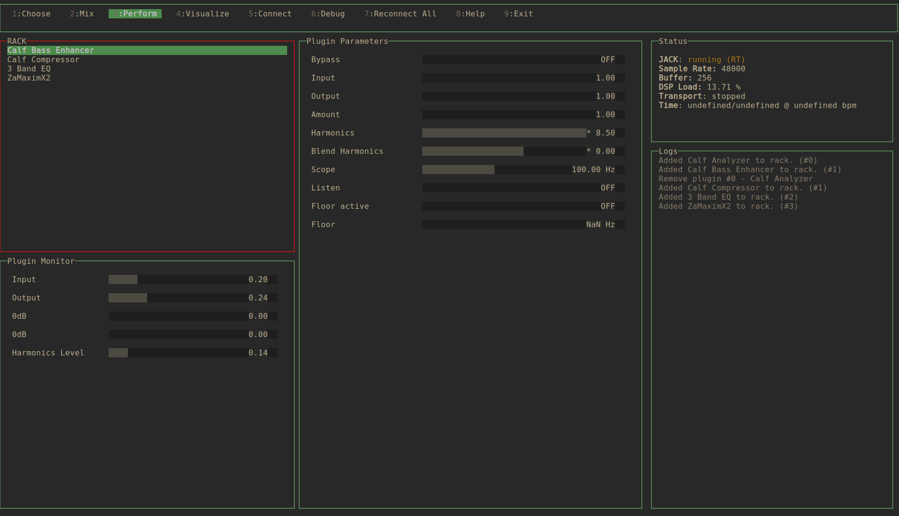
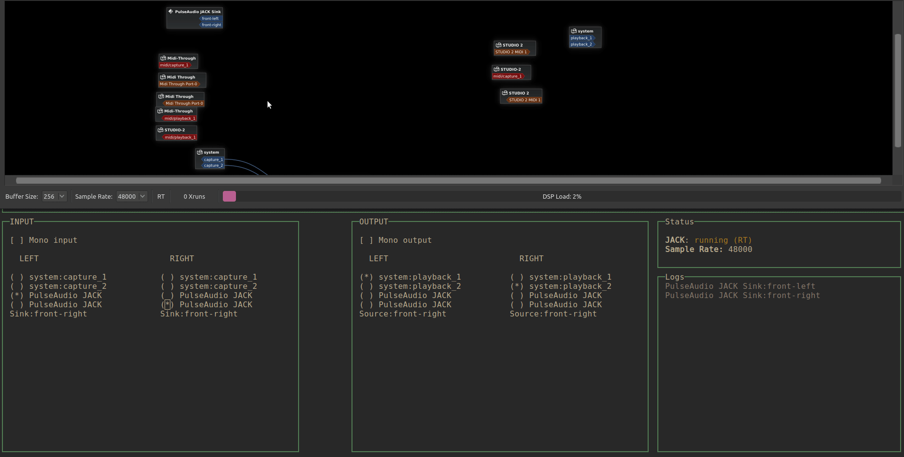

# Calvo 🧑🏼‍🦲

Calvo is a [jalv](http://drobilla.net/software/jalv) based LV2 plugin browser and host to stack plugins in a rack fashion.




# Features

- Runs entirely on the terminal.
- Suports launching multiple instances of jalv and eventually calvo.
- Category based plugin browser.
- Autoconnect inputs of system, and every plugin, linearly until reaching configured output. Dealing with mono/stereo conversion along the way.
- Basic parameters controls.
- Basic plugin output controls monitoring.
- Load plugin presets.
- Move plugins order.
- Alpha

# Limitations

- No GUI customization is loaded, any plugin which has a UI based workflow won't work properly.
- Only works with mono or stereo inputs/outputs.
- Monitoring is best effort and should not be taken too seriously.

### Roadmap to 1.0: [Milestone](https://github.com/ajboni/calvo/milestone/1)

# Dependencies

It uses:

- [jalv](http://drobilla.net/software/jalv) to host plugins
- [lilv](http://drobilla.net/software/lilv) to get plugin data
- [blessed](https://github.com/chjj/blessed) for the UI.
- nodejs to glue all together

# Settings

Modify `.config.yaml` with your settings, more info [in the docs](https://ajboni.github.io/calvo/module-settings.html).

# Keyboard shortcuts

## KEYBOARD SHORTCUTS

| Context                  | Modifier | Combination         | Action                                               |
| ------------------------ | -------- | ------------------- | ---------------------------------------------------- |
| General                  | -        | 1 ... 9             | Select menu option.                                  |
| General                  | -        | TAB                 | Focus next widget                                    |
| Layout                   | SHIFT    | TAB                 | Focus previous widget                                |
| Rack                     | -        | RETURN              | Select plugin.                                       |
| Rack                     | -        | DELETE              | Remove Plugin                                        |
| Rack                     | CTRL     | UP / DOWN           | Swap plugins up/down                                 |
| Plugin Parameters Widget | -        | UP / DOWN - TAB     | Cycle through parameters.                            |
| Plugin Parameters Widget | -        | LEFT / RIGHT        | Change parameter value by default step               |
| Plugin Parameters Widget | SHIFT    | LEFT / RIGHT        | Change parameter value by small step.                |
| Plugin Parameters Widget | CTRL     | LEFT / RIGHT        | Change parameter value by big step.                  |
| Plugin Parameters Widget | -        | PAGE_UP / PAGE_DOWN | Change parameter value by 1/5 of the maximum allowed |

# DEV

Still need to figure out a way to distribute this.
For the time being it can be build from source.
Make sure to have the dependencies installed first.

```
git clone repo
git submodule init
git submodule update
npm install
npm start
```

### Documentation

Dev Documentation is available at: https://ajboni.github.io/calvo/

To build doc locally:

```
npm run document
```

documentation will be available at ./docs
@TODO: set up travis build to do this automatically
